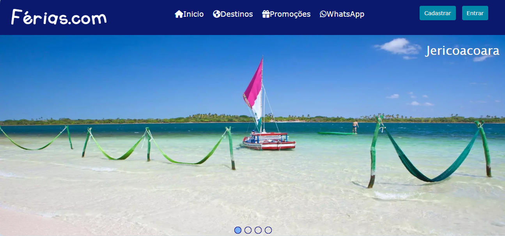
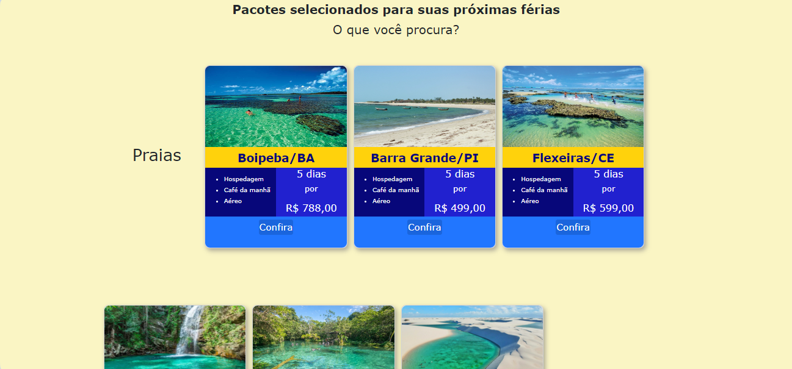
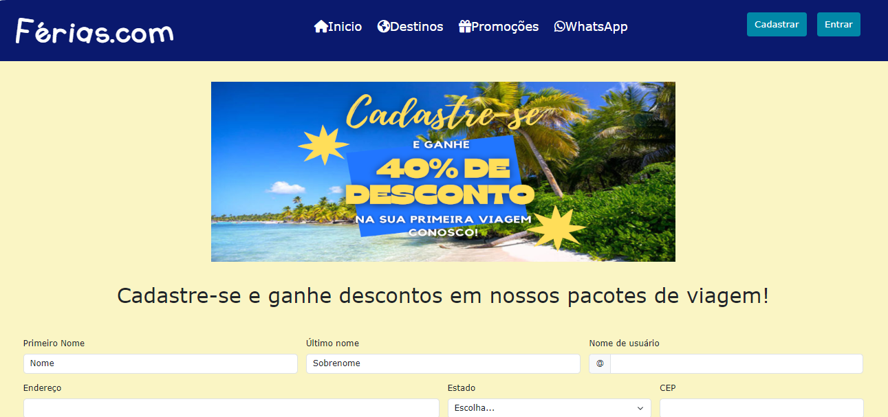
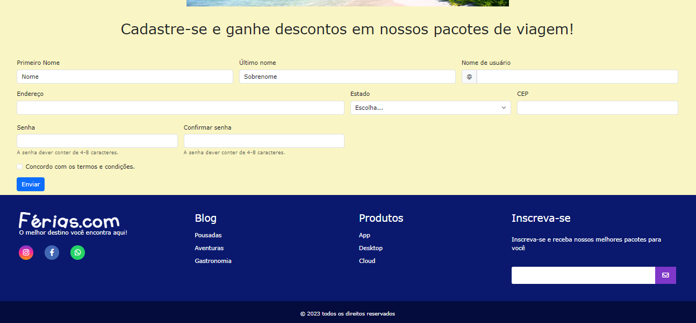
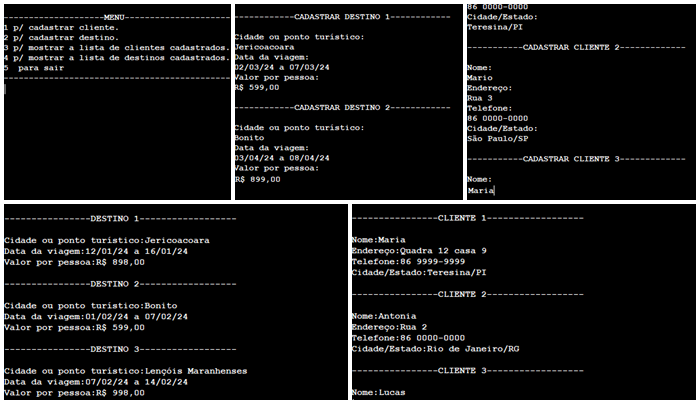

# Atividade-Pr-tica-do-M-dulo-2
## Sobre o projeto

Trata-se de dois projetos: um protótipo de site de viagens em HTML, CSS e Bootstrapp; e uma simulação de cadastro de clientes e destinos em pseudocódigo Portugol.

Os projetos foram construídos no curso de Desenvolvedor Full Stack da Recode Pro, como requisito para obter a nota final do Módulo 2.

## Layout web

## Pseudocódigo

# Tecnologias utilizadas
## Back end
- Portugol

## Front end
- HTML
- CSS

## Implantação em produção
- Back end: Visualg
- Front end web: Visual Studio Code

